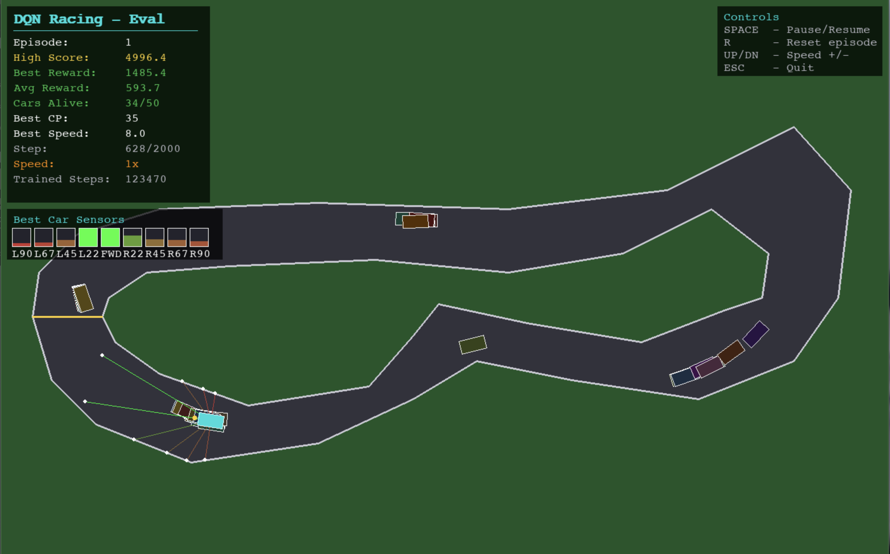

# Autonomous Racing Car using Deep Q-Network (DQN)

A reinforcement learning project that trains autonomous racing cars to navigate a Jeddah Corniche-inspired circuit using **Dueling Double DQN** with **Prioritized Experience Replay**. Built with PyTorch and Pygame.



---

## Table of Contents

- [Overview](#overview)
- [Deep Q-Learning Theory](#deep-q-learning-theory)
- [Architecture](#architecture)
- [State & Action Spaces](#state--action-spaces)
- [Reward Function](#reward-function)
- [Installation](#installation)
- [Usage](#usage)
- [Hyperparameters](#hyperparameters)
- [License](#license)

---

## Overview

The agent controls multiple cars (200 in parallel) equipped with **9 LiDAR sensors** that measure distances to track walls at different angles. Through trial-and-error, the DQN learns an optimal driving policy that maximizes checkpoint progress while avoiding collisions.

**Key Features:**
- Dueling Double DQN with Prioritized Experience Replay (PER)
- 9-direction LiDAR sensor simulation
- 200 cars training simultaneously (single shared network)
- Jeddah Corniche F1-inspired track with 19 turns
- Checkpoint distance-based reward shaping
- Idle and spinning detection with penalties
- Soft target network updates ($\tau = 0.005$)
- Auto-save every 50,000 training steps
- Real-time visualization with Pygame

---

## Deep Q-Learning Theory

### Bellman Optimality Equation

The foundation of Q-learning is the Bellman equation, defining the optimal action-value function:

$$Q^{*}(s, a) = \mathbb{E}\left[r + \gamma \cdot \max_{a'} Q^{*}(s', a') \mid s, a\right]$$

| Symbol | Description |
|--------|-------------|
| $Q^{*}(s, a)$ | Optimal expected cumulative reward for action $a$ in state $s$ |
| $r$ | Immediate reward |
| $\gamma$ | Discount factor (0.99) |
| $s'$ | Next state |
| $\max_{a'} Q^{*}(s', a')$ | Best achievable value from next state |

### Double DQN

Standard DQN overestimates Q-values because the same network selects and evaluates actions. Double DQN decouples these:

$$a^{*} = \arg\max_{a} Q_{\theta}(s', a)$$

$$y = r + \gamma \cdot Q_{\theta^{-}}(s', a^{*})$$

Where $\theta$ is the policy network and $\theta^{-}$ is the target network.

### Dueling Architecture

The network splits into two streams after shared feature extraction:

$$Q(s, a) = V(s) + \left(A(s, a) - \frac{1}{|\mathcal{A}|}\sum_{a'} A(s, a')\right)$$

| Stream | Purpose |
|--------|---------|
| $V(s)$ | State value — how good is this state regardless of action |
| $A(s, a)$ | Advantage — relative benefit of each action |

### Prioritized Experience Replay (PER)

Instead of uniform random sampling, transitions with higher TD-error are sampled more frequently:

$$P(i) = \frac{p_{i}^{\alpha}}{\sum_{k} p_{k}^{\alpha}}, \quad p_{i} = |\delta_{i}| + \epsilon$$

Where $\delta_{i}$ is the TD-error. Importance-sampling weights correct the bias:

$$w_{i} = \left(\frac{1}{N \cdot P(i)}\right)^{\beta}$$

$\beta$ anneals from 0.4 to 1.0 during training.

### Soft Target Updates

Instead of periodic hard copies, the target network is updated every training step:

$$\theta^{-} \leftarrow \tau \cdot \theta + (1 - \tau) \cdot \theta^{-}$$

With $\tau = 0.005$, providing smooth, stable learning.

### Loss Function

Weighted Huber (Smooth L1) loss with PER importance-sampling:

$$\mathcal{L} = \frac{1}{N}\sum_{i=1}^{N} w_{i} \cdot \text{SmoothL1}\left(Q_{\theta}(s_{i}, a_{i}) - y_{i}\right)$$

Gradients are clipped: $\lVert\nabla\rVert_{\max} = 1.0$

---

## Architecture

```
Autonomous-Racing-Car/
├── model.py          # Dueling DQN network + SumTree + PER buffer
├── environment.py    # Track, car physics, LiDAR sensors, rewards
├── agent.py          # DQN agent (PER training, soft updates, save/load)
├── main.py           # Entry point (training & evaluation)
├── requirements.txt  # Dependencies
├── Demo.png          # Training screenshot
└── README.md
```

### Neural Network

```
Input (12) → Linear(256) → LayerNorm → ReLU
           → Linear(256) → LayerNorm → ReLU
           → Linear(128) → LayerNorm → ReLU
           ├→ Value Stream  → Linear(1)
           └→ Advantage Stream → Linear(5)
           → Q(s,a) = V(s) + (A(s,a) - mean(A))
```

---

## State & Action Spaces

### State Space (12 dimensions)

| Index | Feature | Range |
|-------|---------|-------|
| 0 | LiDAR $-90°$ (Left) | $[0, 1]$ |
| 1 | LiDAR $-67.5°$ | $[0, 1]$ |
| 2 | LiDAR $-45°$ | $[0, 1]$ |
| 3 | LiDAR $-22.5°$ | $[0, 1]$ |
| 4 | LiDAR $0°$ (Forward) | $[0, 1]$ |
| 5 | LiDAR $+22.5°$ | $[0, 1]$ |
| 6 | LiDAR $+45°$ | $[0, 1]$ |
| 7 | LiDAR $+67.5°$ | $[0, 1]$ |
| 8 | LiDAR $+90°$ (Right) | $[0, 1]$ |
| 9 | Normalized speed | $[0, 1]$ |
| 10 | $\sin(\theta)$ | $[-1, 1]$ |
| 11 | $\cos(\theta)$ | $[-1, 1]$ |

### Action Space (5 discrete actions)

| Action | Description |
|--------|-------------|
| 0 | Accelerate |
| 1 | Brake |
| 2 | Turn Left + Accelerate |
| 3 | Turn Right + Accelerate |
| 4 | Coast (no input) |

---

## Reward Function

The reward function uses **potential-based shaping** to guide learning:

| Component | Formula / Value | Purpose |
|-----------|----------------|---------|
| Collision | $-10.0$ | Punish crashing |
| Checkpoint crossed | $+25.0$ | Reward track progress |
| Distance shaping | $\Delta d \times 0.05$ | Reward moving toward next checkpoint |
| Speed bonus | $\frac{v}{v_{\max}} \times 1.0$ when $v > 0.5$ | Encourage fast driving |
| Slow penalty | $-0.5$ | Punish standing still |
| Idle ($>30$ steps) | $-2.0$ | Kill spinning/stuck behavior |
| Idle ($>15$ steps) | $-1.0$ | Early idle warning |
| No checkpoint ($>300$ steps) | $-1.5$ | Force forward progress |
| No checkpoint ($>150$ steps) | $-0.5$ | Early stagnation warning |
| Wall proximity | $-(0.1 - d_{\min}) \times 5.0$ when $d_{\min} < 0.1$ | Keep distance from walls |

---

## Installation

### Prerequisites

- Python 3.9+
- pip

### Setup

```bash
git clone https://github.com/uzbtrust/Autonomous-Racing-Car.git
cd Autonomous-Racing-Car
python -m venv venv
source venv/bin/activate  # macOS/Linux
pip install -r requirements.txt
```

> **Note**: For GPU acceleration, install PyTorch with CUDA support from [pytorch.org](https://pytorch.org/get-started/locally/). The agent automatically detects CUDA, Apple MPS, or falls back to CPU.

---

## Usage

### Train the Agent

```bash
python main.py --mode train
```

### Train Without Rendering (faster)

```bash
python main.py --mode train --no-render
```

### Evaluate a Trained Agent

```bash
python main.py --mode eval
```

### Controls

- **ESC** — Stop training and save checkpoint
- Training auto-resumes from `model.pth` if it exists

---

## Hyperparameters

| Parameter | Value | Description |
|-----------|-------|-------------|
| Learning Rate | $3 \times 10^{-4}$ | Adam optimizer step size |
| Discount ($\gamma$) | $0.99$ | Future reward weighting |
| Epsilon Start | $1.0$ | Initial exploration rate |
| Epsilon End | $0.02$ | Minimum exploration rate |
| Epsilon Decay | $0.99997^{N_{cars}}$ per step | Step-based decay |
| Batch Size | $128$ | Samples per training iteration |
| Train per Step | $4$ | Training iterations per environment step |
| Replay Buffer | $300{,}000$ | PER buffer capacity |
| PER $\alpha$ | $0.6$ | Prioritization exponent |
| PER $\beta_0$ | $0.4$ | Initial importance-sampling exponent |
| Soft Update $\tau$ | $0.005$ | Target network interpolation |
| Gradient Clip | $1.0$ | Max gradient norm |
| Network | $256 \to 256 \to 128$ | Hidden layers with LayerNorm |
| Cars | $200$ | Parallel training agents |

---

## License

This project is for educational and research purposes.

---

<p align="center">Made with ❤️ by uzbtrust</p>
